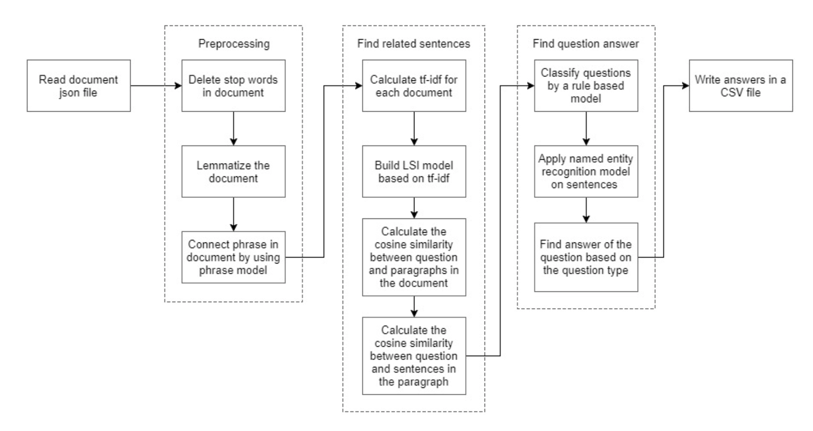

# QuestionAnsweringSystem

## Introduction
This is a question answering system: given a question and a document, the goal is to find the answer to that question in the corresponding document. 

## Model

1. Preprocessing

In the preprocessing, we transfer the input json file to a list of paragraphs which does not contain stop words in nltk stop word list. All words are lemmatized by spacy lemmatizer and word in phrases are connected by gensim phrase model.

2. Find Related Sentences

We calculate a vector for question and vectors for each paragraph in the document in the gensim LSI model based on the tf-idf value of the words. Then, we choose top three paragraph based on the cosine similarity with the question vector. 

After getting the related paragraphs, we find the related sentences in the paragraph in a similar way by calculating the cosine similarity between question vector and sentence vector in the LSI model. Top five sentences with a high cosine similarity are extracted from the top three paragraphs.

3. Classify Questions

We classify all the questions into 9 types: date, reason, GPR(countries, cities, states), person, percent, cardinal, none phrase, ordinal, and others.

4. Find Answer to the Question

We find the answer to the question based on the type of question. For questions with type Date, Reason, GPE, Person, Percent, Cardinal and Ordinal, we find the named entities with corresponding type based on spacy’s entity recognizer. 

To find the answer for questions with type NN, we use rule-based methods. First, we find the root and the keyword of question by the dependency parser of spacy. All the answers to NN questions are noun chunks we get by spacy Tagger because the answer to NN questions are noun phrases. If the lemmatized root is ‘be’ or ‘have’, the keyword of the question is the ‘nsubj’ (nominal subject) of the question. If the question dose not have a nsubj, the keyword is the ‘dobj’ (direct object) or ‘pobj’ (object of preposition) of the question. Then we find the sentences which have the keyword from the related sentences we get . The answer is all noun chunks of the the sentence that does not appear in the question. The reason is that the answer can be nsubj, dobj, and pobj, and the keyword occurs in one of the noun chunk in the sentence. If the lemmatized root is not ‘be’ or ‘have’, the keyword of the question is question root. After that, we also find the sentences with keyword and then find the answer in these sentences. The answer is all noun chunks between the keyword and the next punctation since the structure of the sentence can be complex. For example, the answer can be both the dobj of the keyword and the pobj of the prep of keyword.
